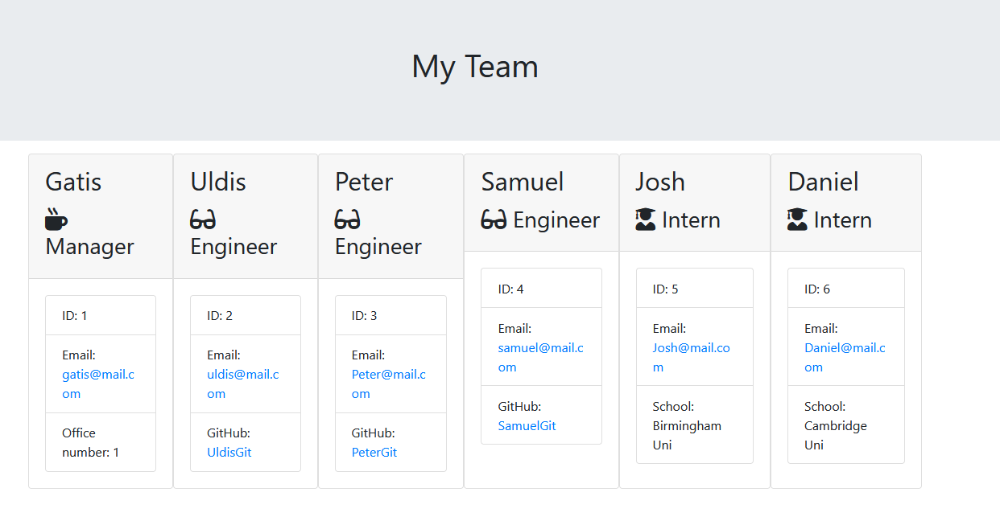

# Team-Profile-Generator

JavaScript application for creating Team HTML file
Application will generate HTML file called `team.html` with values which ones will
required to be inputted with `Inquirer` npm package help

On application initial run user inputs will be for Team manager.
After all required information is filled, application will display 3 option menu list where user is able to choose from

- Add Engineer
- Add Intern
- Or Exit Application

On `application exit` selection application will generate HTML file in `output` folder

## Instalation

Module instalations

```
npm i
```

## Tests

Tests using Jest npm module

```
npm run test
```

## Usage

```
node index.js
```

## Screenshot



## Resources

[Inquirer](https://www.npmjs.com/package/inquirer)

[Jest](https://www.npmjs.com/package/jest)
